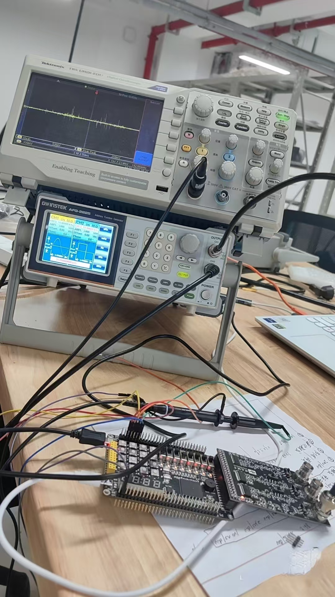
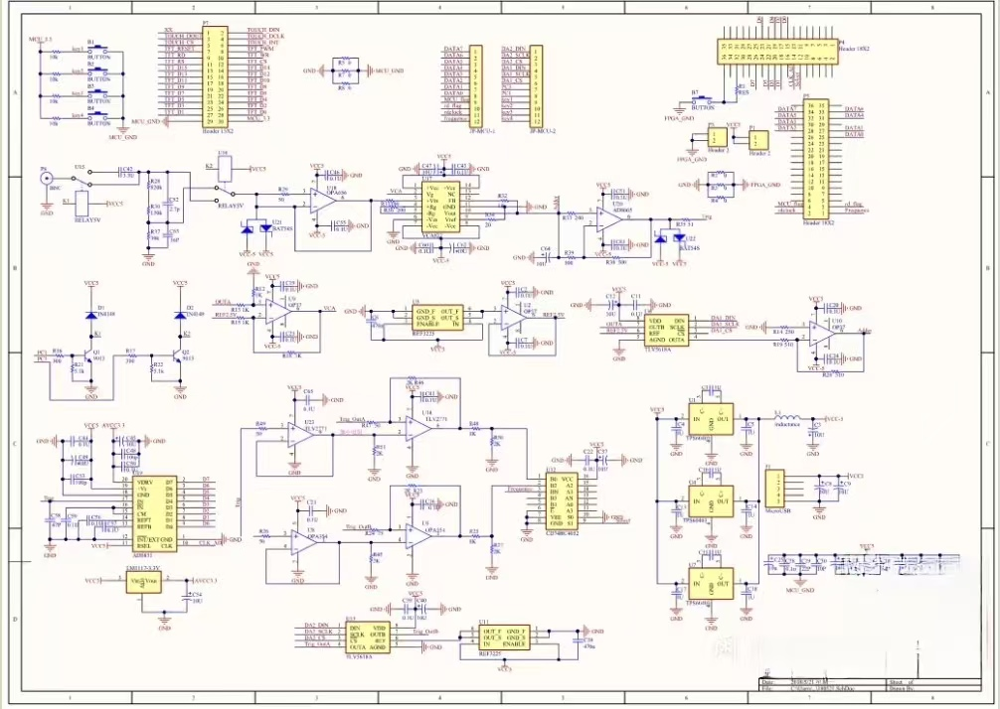

# shiboqi

这是一台具有实时采样和等效采样功能的数字示波器工程。

项目包含前端信号调理电路的原理图与 PCB，以及 FPGA 端的采样、存储和串口发送逻辑。工程可实现 2M 实时采样等效成 200M 采样率的效果。该项目不包含 MCU 端代码。

## 工程内容

- 前端信号调理电路原理图
- 前端信号调理电路 PCB
- FPGA 端采样逻辑
- FPGA 端数据存储逻辑
- FPGA 端串口发送逻辑
- 实时采样与等效采样相关实现

## FPGA 平台

- 安路科技 FPGA
- Xilinx FPGA

## 项目图片

## 工程下载

完整工程已打包为 `shiboqi.rar`，请在本仓库的 [Release 页面](https://github.com/taojiawei-sarem/shiboqi/releases/tag/v1.0.0) 下载。

如果您觉得有用的话，请点一个 star。
